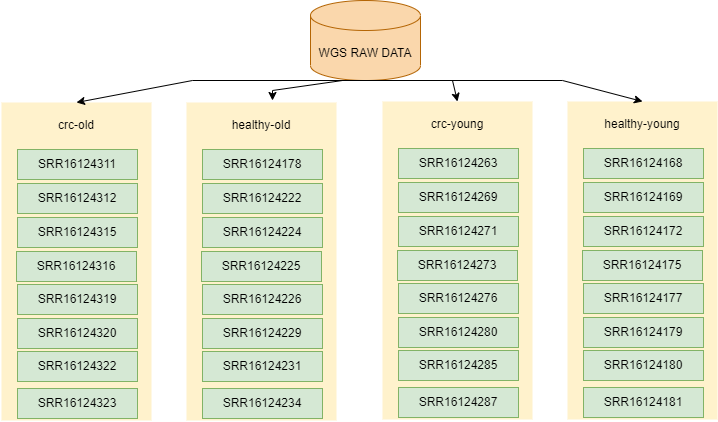

# Shotgun Sequencing Analysis of the Gut Microbiome in Colorectal Cancer Patients

## Introduction
Colorectal cancer (CRC) is a disease whereby uncontrolled division of abnormal cells is observed
in the rectum or colon. It can also be referred to as bowel cancer due to the colon and rectum being a 
part of the large intestine (the bowel). There are several factors that can be associated with the development
of CRC such as age, sex, and race/ethnicity.
In recent years, it has been suggested that microbes colonizing the gut, contribute to cancer growth in
the colon or rectum. This has led to researchers investigating the dynamic and variable gut microbiome,
so as to understand its role in promoting CRC.

## Aim
Determine the taxonomic abundance and functional potential of the microbial communities of colorectal cancer patients
## Objectives  
 
 - Compare the gut microbiome composition of colorectal cancer patients with healthy individuals.
 - Compare the gut microbiome composition between old and young colorectal cancer patients.
 - Predict conserved bacterial functions using in-silico bacterial metagenomic analysis 

 ## People/ Team
 * Olaitan I. Awe, African Society for Bioinformatics and Computational Biology, laitanawe@gmail.com
 * Nouhaila En najih, Systems and Data Engineering Team, Abdelmalek Essaadi University, nouhailaennajih25@gmail.com
 * Ruvarashe Joylyne Madzime, Faculty of Medicine and Health Sciences, Stellenbosch University, ruvarashemadzime@gmail.com
 * Omolanke Temitope Oyedemi, Department of Microbiology, Adeleke University, topeoyedemi07@gmail.com
 * Edward Jenner Tettevi, Biomedical and Public Health Research Unit, Council for Scientific and Industrial Research-WRI, ejtettevi@gmail.com
 * Latifah Benta Mukanga, Department of Life Sciences, South Eastern Kenya University, latifahmukanga@gmail.com
