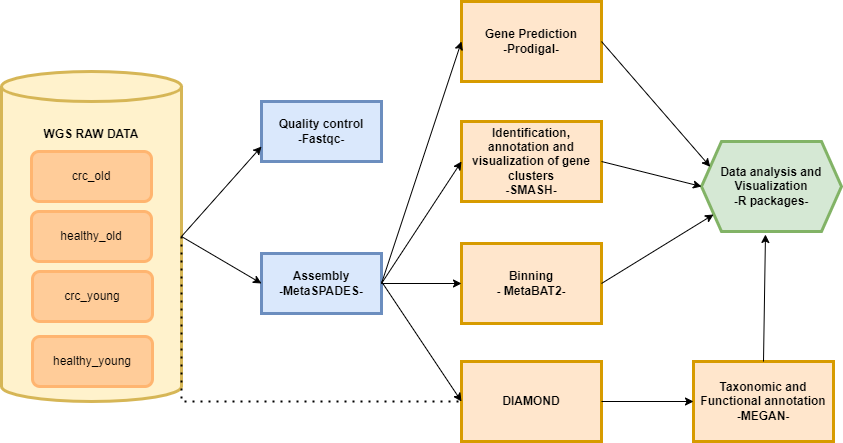

# Shotgun Sequencing Analysis of the Gut Microbiome in Colorectal Cancer Patients

## Introduction
Colorectal cancer (CRC) is a disease whereby uncontrolled division of abnormal cells is observed
in the rectum or colon. It can also be referred to as bowel cancer due to the colon and rectum being a 
part of the large intestine (the bowel). There are several factors that can be associated with the development
of CRC such as age, sex, and race/ethnicity.
In recent years, it has been suggested that microbes colonizing the gut, contribute to cancer growth in
the colon or rectum. This has led to researchers investigating the dynamic and variable gut microbiome,
so as to understand its role in promoting CRC. 
Next Generation Sequencing technologies allow for a flexible investigation of variation in diversity 
and abundance of bacteria. Shotgun sequencing is useful in determining the genome of an organism. It involves
breaking down the genome into small fragments. Computational tools and algorithms are then applied to 
assemble the fragments into the full genome. Shotgun sequencing can include 16SrRNA sequencing or metagenomics
sequencing. Shotgun 16SrRNA sequencing can be used to detect microbial communities and phylogenies within a sample.
Shotgun metagenomics allows for better discrimination of taxa at species level of strain level,
functional characterisation and de novo assembly of metagenomes.

## Aim
 - Reveal the microbial composition and ecological changes in patients with colorectal cancer  
 - Characterize microbial implicates in Colorectal Cancer infections using shotgun metagenomics approach  
 - Predict conserved bacterial functions using in-silico bacterial metagenomic analysis  
 - Validate the pipeline using Squeezemeta and YAMP

## Methodology
 - Collect WGS samples of CRC patients and healthy individuals
 - Quality control
 - Trimming
 - Remove Redundant Genes 
 - Gene Prediction
 - Quantification
 - Binning
 - Identification, Annotation, and Visualization of gene clusters
 - Taxonomic and functional information

 ## Workflow

 ## People/ Team
 * Olaitan I. Awe, African Society for Bioinformatics and Computational Biology, laitanawe@gmail.com
 * Nouhaila En najih, Systems and Data Engineering Team, Abdelmalek Essaadi University, nouhailaennajih25@gmail.com
 * Ruvarashe Joylyne Madzime, Faculty of Medicine and Health Sciences, Stellenbosch University, ruvarashemadzime@gmail.com
 * Omolanke Temitope Oyedemi, Department of Microbiology, Adeleke University, topeoyedemi07@gmail.com
 * Edward Jenner Tettevi, Biomedical and Public Health Research Unit, Council for Scientific and Industrial Research-WRI, ejtettevi@gmail.com
 * Latifah Benta Mukanga, Department of Life Sciences, South Eastern Kenya University, latifahmukanga@gmail.com
